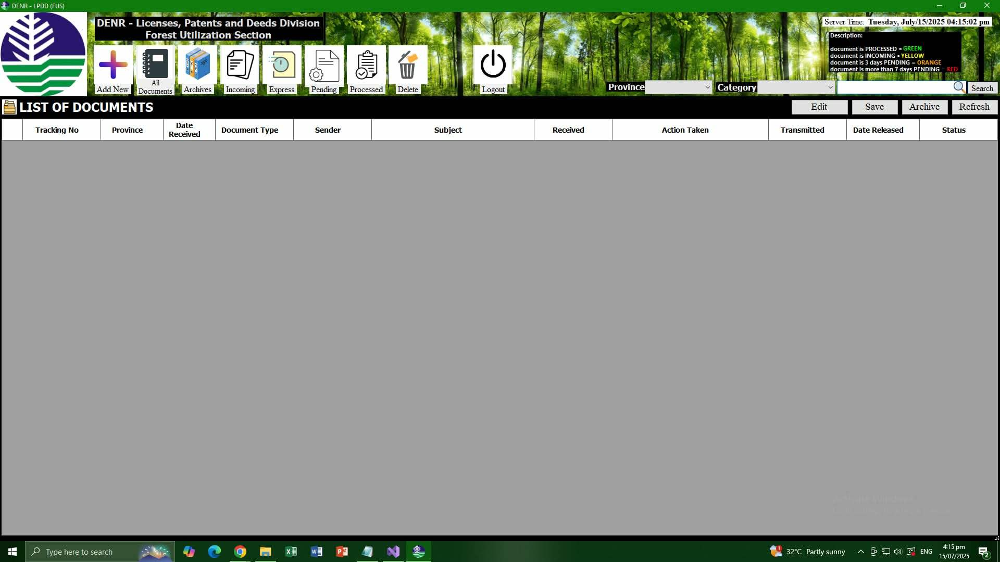
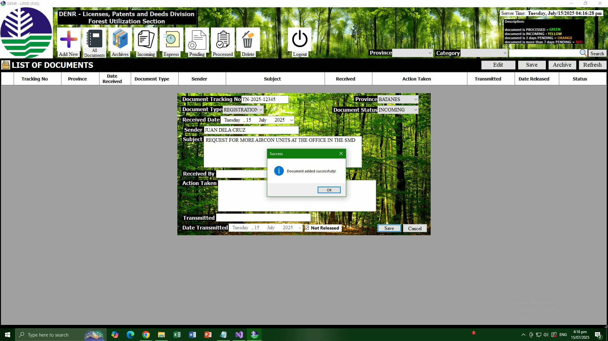
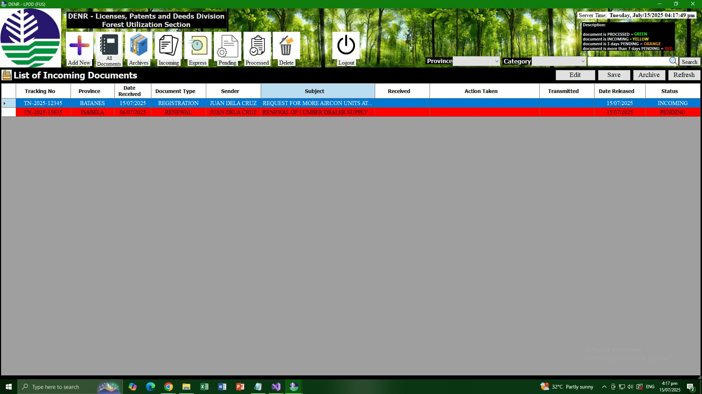

# DENR-LPDD-FUS Document Tracking System v1.1

**Company:** DENR - Forest Utilization Section, Licenses, Patents and Deeds Division 
**Role:** Systems Engineer Intern | Computer Engineering Grad June 2026 
**Tech:** C# .NET WinForms, MySQL, SQL, SDLC, UAT

### 1. The Problem
FUS-LPDD had 1000+ paper records. Staff spent 5-10 mins to manually find 1 document.

### 2. My Engineering Process
**V1 Prototype:** Built .NET + MySQL system with Login, CRUD, Status Tracking. 
**User Feedback:** Conducted UAT with 50+ FUS-LPDD staff. Feedback: UI too cluttered. 
**V1.1 Iteration:** Redesigned UI. Improved status colors: INCOMING=YELLOW, PENDING=RED. 

### 3. The Result 
**Impact:** 60% faster retrieval. Eliminated paper filing errors. Deployed.

### 4. Screenshots
 
 
 

**Note:** Source code is proprietary to DENR and cannot be shared publicly.
